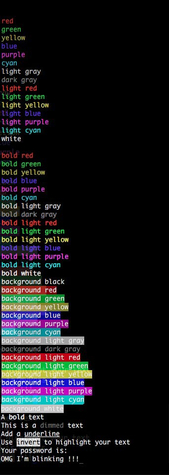

# GoLang Colorized Output

GoLang colorized output library for Mac & Linux Shell, [中文版说明](README_CN.md)

## Showcase

## Install

1. __Make sure__ your've read [GoLang Official File Structure](https://golang.org/doc/code.html)
2. Make sure you've set a correct GOPATH
3. `$ go get github.com/bclicn/color`
4. In your script, `import "github.com/bclicn/color"` then call `color.Test()`
5. Use `fmt.Println("Hello" + color.Red("World"))` to assemble a colorized output
6. API examples available in `color-test.go`

## Quick (brainless) Usage

1. Download `color.go`
2. Modify its `package color` to `package main`
3. Put your script under the same directory and write `fmt.Println(Red("I'm red !!!"))`
4. Run `go run color.go yourScript.go`
5. Or build by `go build color.go yourScript.go`

## A simple test script

    package main

    import (
	    "fmt"
	    "github.com/bclicn/color"
    )

    func main(){
	    fmt.Println(color.Red("Red output"))
	    color.Test()
    }

## License

[MIT](LICENSE)

Beichen Li, 2016-11-4

 